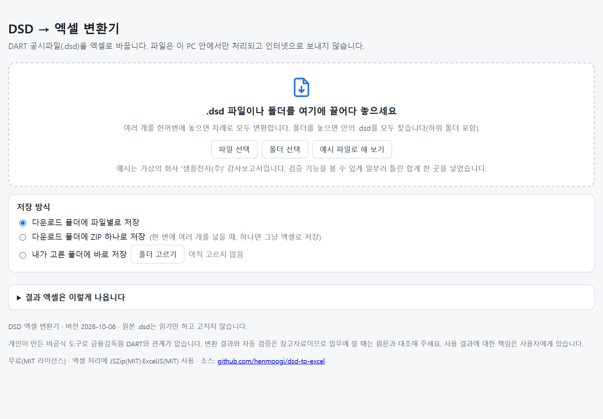
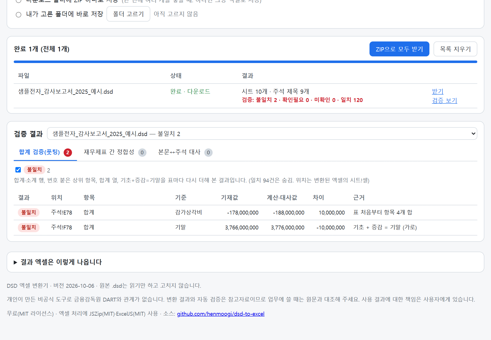
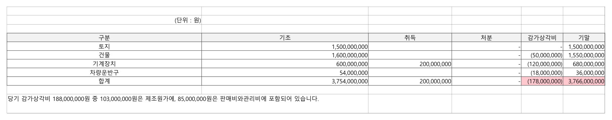

# DSD → 엑셀 변환기 (dsd-to-excel)

DART 공시파일(`.dsd`)을 엑셀(`.xlsx`)로 한 번에 바꾸고, 재무제표의 **합계·정합성을 자동으로 검사**하는 도구입니다.

👉 **바로 쓰기: https://henmoogi.github.io/dsd-to-excel/**

- 설치할 것이 없습니다. 크롬·엣지·웨일 같은 브라우저만 있으면 됩니다.
- 파일은 **브라우저 안에서만** 처리됩니다. 서버로 보내지 않으며, 한 번 연 뒤에는 인터넷 없이도 동작합니다.
- 원본 `.dsd`는 읽기만 하고 고치지 않습니다.



## 할 수 있는 일

**1. 엑셀로 변환**
- 시트: 목차 · 검증 · 표지 · 감사보고서 · 재무상태표 · 손익계산서 · 자본변동표 · 현금흐름표 · 주석 · 외부감사실시내용
- 표의 병합 셀·테두리·머리글 음영을 원문대로 살립니다.
- 숫자는 계산할 수 있는 실제 숫자로 들어갑니다. `(1,234)`는 −1,234, `12.5%`는 0.125입니다.
- 목차 시트에서 시트와 주석 제목을 누르면 그 위치로 갑니다. 주석 시트는 주석 번호별로 접고 펼 수 있습니다.

**2. 여러 파일 한꺼번에**
- 파일 여러 개나 폴더를 끌어다 놓으면 차례로 모두 변환합니다(하위 폴더 포함).
- 저장 방식: 파일별 다운로드 / ZIP 하나로 / 내가 고른 폴더에 바로 저장(크롬·엣지)

**3. 자동 검증**

| 검사 | 내용 |
|---|---|
| 세로 합계 | 합계·총계·소계 행 = 위 항목의 합 |
| 상위 항목 합계 | Ⅰ. (1) 같은 번호 행 = 바로 아래 하위 항목의 합 |
| 가로 합계 | 합계 열 = 왼쪽 열의 합 |
| 증감 | 기초 + 증감 = 기말 (행 방향·열 방향) |
| 재무제표 간 | 자산총계 = 부채와자본총계, 당기순이익·기말현금·자본총계가 재무제표끼리 같은지 |
| 본문 ↔ 주석 | 재무제표 과목의 `(주석6)` 금액이 6번 주석에 있는지 |

결과는 불일치 · 확인필요 · 단수차이 · 미확인 · 일치로 나뉩니다. 화면의 **검증 결과** 패널과 엑셀의 **검증** 시트에 나오고, 불일치 셀은 엑셀에서 연한 빨강으로 칠해집니다.



## 예시 파일로 해 보기

가진 `.dsd`가 없으면 화면의 **[예시 파일로 해 보기]** 단추를 누르세요. 가상의 회사 '샘플전자(주)'의 감사보고서로 변환과 검증을 해 볼 수 있습니다. 검증 기능을 보여 주려고 유형자산 주석 표의 합계 한 곳을 일부러 틀리게 넣어 두었습니다.



## 내려받아 쓰기

인터넷이 막힌 PC에서 쓰려면 [릴리스](https://github.com/henmoogi/dsd-to-excel/releases/latest)에서 `dsd-to-excel_v<버전>.html` 하나만 받아 더블클릭하면 됩니다. 함께 있는 `SHA256SUMS.txt`로 원본인지 확인할 수 있습니다.

```powershell
Get-FileHash .\dsd-to-excel_v2026.10.06.html -Algorithm SHA256
```

## 알아 두기

- 감사보고서와 반기검토보고서로 시험했습니다. 연결재무제표·사업보고서 등 다른 문서는 아직 충분히 시험하지 않았습니다.
- 자동 검증은 표의 모양을 보고 판단합니다. 서식이 특이한 표는 잘못 판단할 수 있으니 '불일치'·'확인필요'는 반드시 원문과 대조해 주세요. '미확인'은 본문 금액을 주석에서 찾지 못해 대사를 못 한 항목입니다.
- 엑셀 → DSD 역변환은 하지 않습니다.

## 면책

개인이 만든 **비공식** 도구로 금융감독원 DART와 관계가 없습니다. 변환 결과와 자동 검증은 참고자료이며, 업무에 쓸 때는 원문과 대조해 주세요. 사용 결과에 대한 책임은 사용자에게 있습니다.

## 라이선스

[MIT](LICENSE) — 자유롭게 쓰고 고치고 나눌 수 있습니다. 사용한 라이브러리는 [THIRD_PARTY_NOTICES.md](THIRD_PARTY_NOTICES.md)를 보세요.

## 직접 고쳐서 빌드하기

변환 규칙은 `src/dsd-core.js`, 검증 규칙은 `src/dsd-checks.js`, 화면은 `src/template.html`에 있습니다.

```bash
node src/build.cjs        # src를 묶어 DSD엑셀변환.html 한 파일로 만든다
```

예시 파일은 `python src/sample/make_sample_dsd.py <파일이름>`으로 다시 만들 수 있습니다(`--no-error`를 붙이면 틀린 합계 없이).
